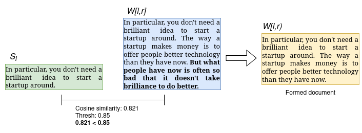
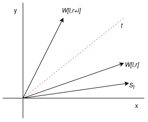
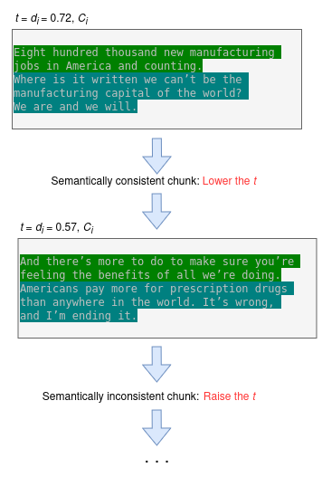

## Horchunk

This package contains an implementation of a dynamic sliding-window-based semantic chunking method, with a tunable 
parameter for the cosine similarity threshold, proposed in this 
[research paper](https://journals.uran.ua/eejet/article/view/326177/317250).

The method was primarily inspired by the percentile-based semantic chunking method presented by Greg Kamradt in the 
[5 Levels Of Text Splitting notebook](https://github.com/FullStackRetrieval-com/RetrievalTutorials/blob/main/tutorials/LevelsOfTextSplitting/5_Levels_Of_Text_Splitting.ipynb).

I would also like to acknowledge the work of Brandon Smith and Anton Troynikov for the development of the 
[Chunking Evaluation Framework](https://research.trychroma.com/evaluating-chunking) for RAG systems, which was used 
during the method's development. In addition to the framework, their work presents an overall study of the quality of 
different chunking methods.

### Benchmarks

### Implemented Method

#### Semantic Splitting 

Initial text is first divided into paragraphs using the regular expression `\n+`, then into sentences based on the delimiters: `!?.`.  
After splitting the text into sentences, the core logic of the algorithm begins.

The algorithm is based on the sliding window technique with a dynamically changing size.  
It sets the pointer $l$ to the first sentence, the pointer $r$ to the second, and then iteratively moves  
the pointer $r$, expanding the window $W[l,r]$. The sentence at pointer $l$ and the window $W[l,r]$ are  
transformed into vectors using the embedding model $E$: 

$$
\begin{cases}
v_l = E(S_l), \\
v_w = E\left(W[l, r]\right).
\end{cases}
$$

Then the distance $d$ between vectors $v_l$ and $v_w$ is calculated using the cosine similarity formula: 

$$
d = \frac{v_l \cdot v_w}{\|v_l\| \cdot \|v_w\|}.
$$

If the distance $d$ is less than the specified threshold $t$, the document $W[l,r)$ is generated. 

Then the $l$ and $r$ pointers are updated as follows: 

$$
\begin{cases}
l = r, \\
r = r + 1.
\end{cases}
$$

The algorithm continues until: 

$$
r \leq i, 
$$

where $i$ is the number of sentences. 

The chunking logic described above is depicted in Figures 1–2.


Fig. 1. Finding the cosine similarity between $S_l$ and the window $W[l,r]$



Fig. 2. Formation of document $W[l,r]$ when exceeding the threshold $t = 0.85$

When expanding the window $W[l,r]$, it is clear how the semantic meaning—in the form of vectors obtained using the  
embedding model—gradually "drifts" from sentence $S_l$ to the sequentially formed windows  
$W[l,r]$, $W[l,r+i]$ (Fig. 3). 

 

Fig. 3. Drift of semantic meaning as the window expands

Adding a new sentence moves the window $W[l, r]$ further from sentence $S_l$. If the new sentence $S_r$ is very  
semantically distant from $S_l$, the cosine similarity will decrease significantly. If it is close, the similarity  
will change only slightly.

Using a high threshold value of $t = 0.95$, depending on the text, will lead to smaller documents with 1–2  
sentences, while a low threshold of $t = 0.72$ will result in larger ones. 

For additional control over the documents being created, the $α$ parameter is used. It limits the maximum number of  
sentences in a document to prevent the creation of excessively large documents with semantically similar sentences.  
Such situations can occur when processing lists or tables with similar values.

For more details, check the [research paper](https://journals.uran.ua/eejet/article/view/326177/317250).

#### Binary Search Threshold Tuning 

The developed adjustment algorithm is based on the binary search algorithm. The source text is divided into paragraphs
and then into sentences just like at the start of `Semantic Splitting` algorithm.

Next, based on the specified size of the static window $m$, divided sentences are sequentially processed and chunks of 
text are formed from – sentences:

$$
C_i = \{s_t, s_{t+1}, \ldots, s_{t+m-1}\}.
$$

For each obtained chunk $C_i$, the first sentence $C_i1$  and  the entire chunk $C_i$  are  transformed  into  vectors  
using the  embedding model $E$:

$$
\begin{cases}
v_l = E(C_l), \\
v_c = E(C_i).
\end{cases}
$$

Next, distances $d_i$ between $v_l$ and $v_c$ is found using cosine similarity.

A dictionary is formed from obtained distances and chunks:

$$
\mathbf{D} = \{(d_1, C_1), (d_2, C_2), \ldots, (d_i, C_i)\}.
$$

The created dictionary $D$ is sorted in ascending order based on distances $d_i$. 

After  receiving  the  sorted  dictionary  $D$, the binary search algorithm is launched with a human evaluation. 
The evaluation is performed by entering a command in the terminal to increase or decrease the threshold value. 
If the generated chunk with a given distance is semantically complete in the human opinion, the threshold is decreased. 
If the generated chunk is semantical-ly different, it is increased. After the evaluation is complete, the found 
distance is returned, the number is limited to two digits after the decimal point. The found value is the threshold $t$ 
(Fig. 4).



Fig. 4. The process of finding the threshold $t$ using an assessment from a person.

Using the binary search-based tuning, the threshold value tof the cosine similarity can be adjusted based on the data 
that will be split. In addition, since the static window size of $m$ sentences is set in the process of forming 
dictionary $D$, the tuning finds  the  minimum  threshold  value  for  forming  semantically  complete documents of $m$ 
sentences or more. 

For more details, check the [research paper](https://journals.uran.ua/eejet/article/view/326177/317250).


### Installation

To install the package, run: 

```bash
pip install "git+https://github.com/panalexeu/horchunk.git"
```

### Usage 
